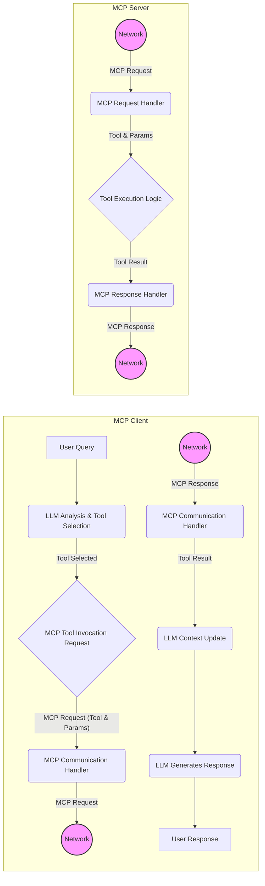

[Running sample](https://kamirine-stock-ticker-agent.hf.space)

Check out the configuration reference at https://huggingface.co/docs/hub/spaces-config-reference

```mermaid
graph LR
    subgraph MCP Client
        A[User Query] --> B(LLM Analysis & Tool Selection);
        B -- Tool Selected --> C{MCP Tool Invocation Request};
        C -- MCP Request (Tool & Params) --> D(MCP Communication Handler);
        D -- MCP Request --> E((Network));
        F((Network)) -- MCP Response --> G(MCP Communication Handler);
        G -- Tool Result --> H(LLM Context Update);
        H --> I(LLM Generates Response);
        I --> J[User Response];
    end

    subgraph MCP Server
        K((Network)) -- MCP Request --> L(MCP Request Handler);
        L -- Tool & Params --> M{Tool Execution Logic};
        M -- Tool Result --> N(MCP Response Handler);
        N -- MCP Response --> O((Network));
    end

    style E fill:#f9f,stroke:#333,stroke-width:2px
    style F fill:#f9f,stroke:#333,stroke-width:2px
    style K fill:#f9f,stroke:#333,stroke-width:2px
    style O fill:#f9f,stroke:#333,stroke-width:2px

    direction LR
```
